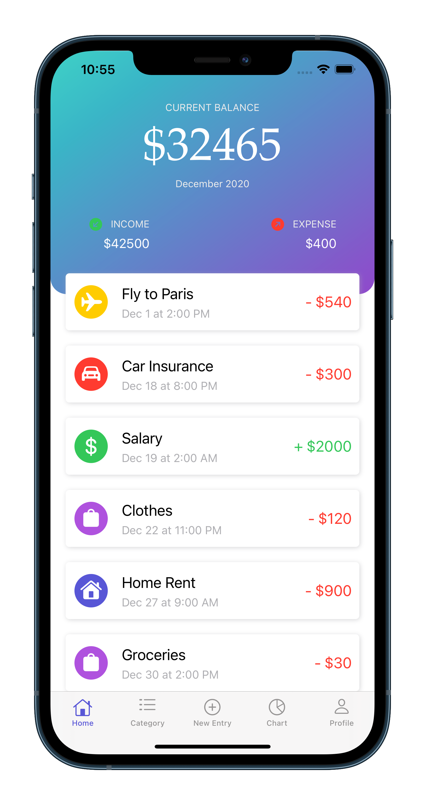
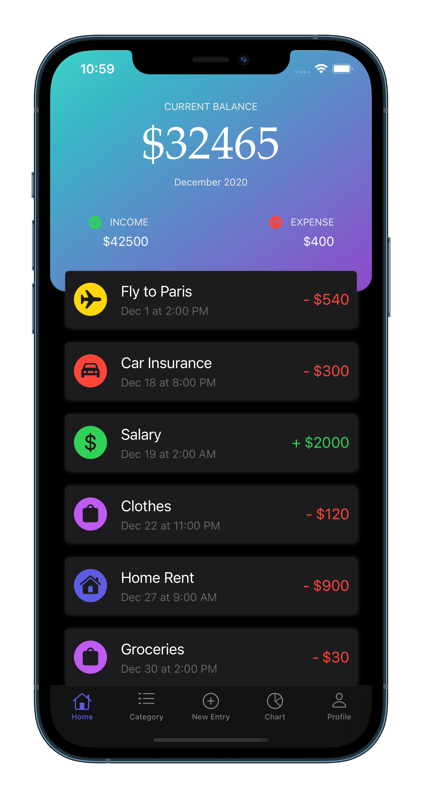
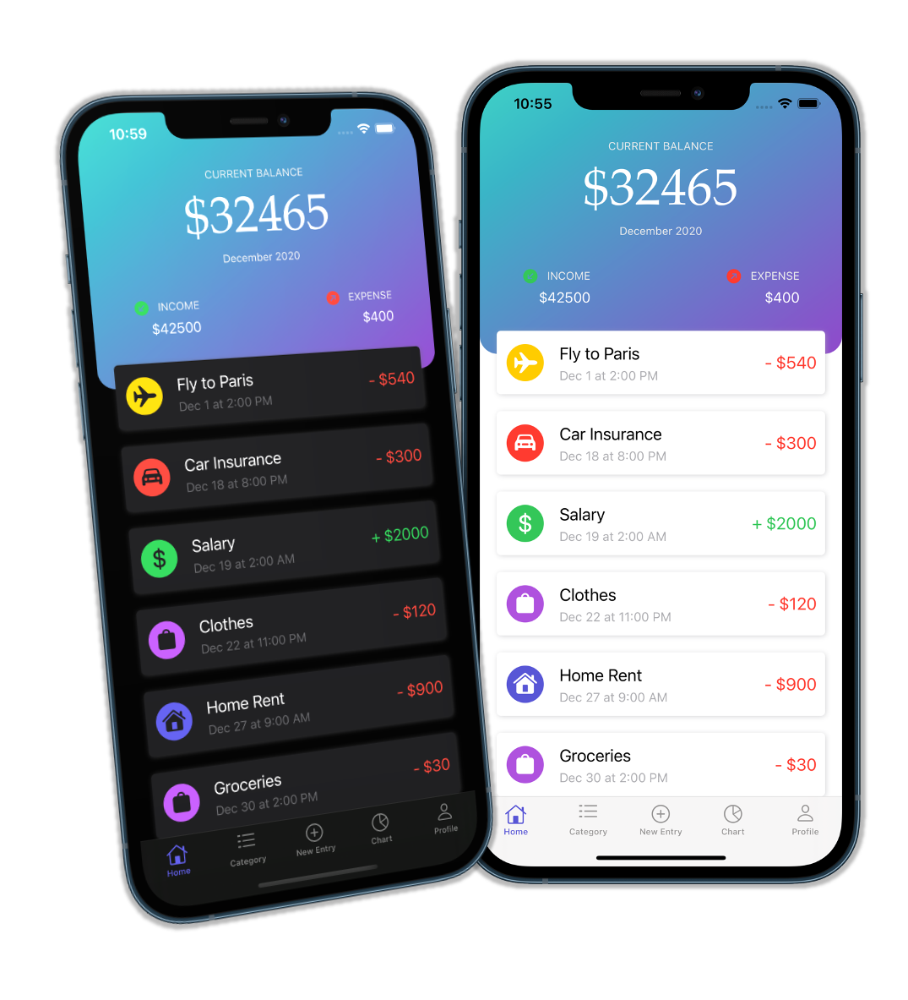

# Coming Soon... 
- Still working on this app.
- Finished home screen UI. Check below for mockup.

# Expense Tracker
- App tracks users expense and income. Gives user chart view for their weekly, monthly and yearly expense. 
- User will be able to select their monthly expense goal, if montly expense comes near goal amout app will notifiy user by push notifications and in app notification.

# Technologies / Libraries used to create this project
- Xcode
- Swift
- Core Data
- Push Notifications

 ## Demo of app
  
 
 
